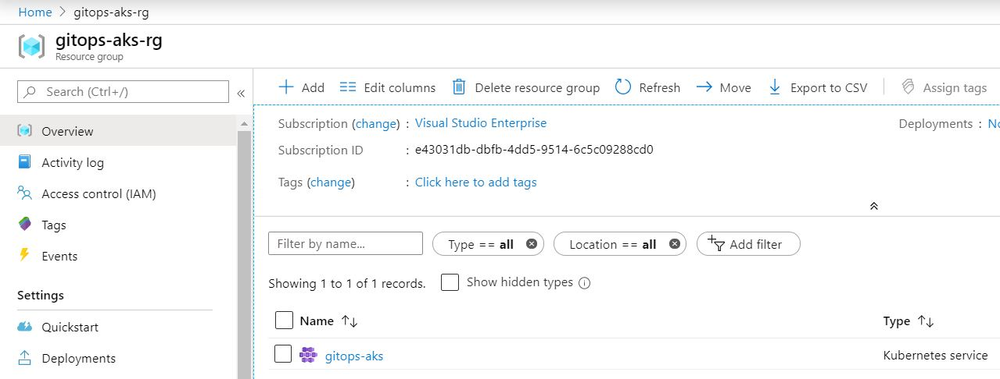

# Create an Azure Kubernetes Service (AKS) Cluster using Tekton

This repo contains ssome ample Tekton manifests (a Task and a Taskrun) for provisioning an AKS cluster named as _gitops-aks_ in a Azure resource group called _gitops-ask_rg_. 

**Prerequisites**  
This repo assumes you have installed Tekton Pipelines and optionally, Tekton Dashboard in a Kubernetes cluster (e.g., Docker-Desktop)

To create a AKS cluster, follow the steps below:
1. Clone [this repo](https://github.com/gitops-architecture/aks).
2. Edit task.yaml, replacing the following with appropriate values:
    - YOUR_AZURE_APPI
    - YOUR_AZURE_PASSWORD
    - YOUR_AZURE_TENANTID
    - YOUR_AZURE_SUBSCRIPTION
3. Run the following command in the a shell:
```
$ kubectl apply -f task.yaml
$ kubectl create -f taskrun.yam
```
Depending on the time of the day or where you are, it may take about 15 minutes for the AKS cluster to be created and ready.

The following screenshot shows the AKS cluster _gitops-aks_ in the resource group _gitops-aks_rg_:  

